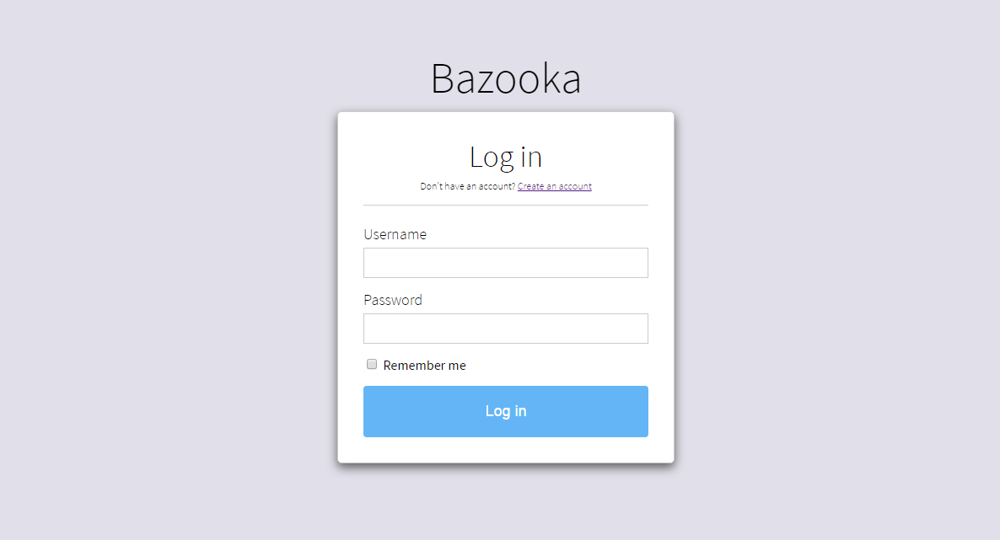

Configuration
===================================

This section assumes you've already installed Bazooka and packaged your applciation and will guide trough the necessary steps to configure and deploy your first application.

Creating your first user
-------------------------

The first thing to do is to login into Bazooka. Point your browser at the URL assigned during website creation and you will reach the login screen.

The first thing to do is to create your first user by clicking the **Create an account** link. You will see the account creation page where you can input the new user data. 

.. Note:: if you have chosen to use Active Directory authentication use the same password to create the user as it will be validated against your Active Directory Controller

.. Note:: The first user created in the system will be automatically an Administrator with full privileges. This can be changed later if it is not adequate.

Taking a look around
-------------------------
Once logged in you will reach  the Dashboard, Bazooka,s main screen. As of now no application has been configured  so it is empty but we will soon change this. 

Creating your enviroments
---------------------------
The next step is enviroments definition and the addition of at least one agent per enviroment. Go to the **Enviroments** section by clicking on the section in the header with the same name. In this page you canc click on the **Create new enviroment** button to create your enviroments. A common organization is Test- UAT (User Acceptance Testing) - Staging and production.

Adding an agent
-------------------------
Once all the enviroments have been created you can add agents to any enviroment by clicking on the **Add new Agent** button.

Configuring your application
------------------------------
Once the enviroments and agents have been configured we can proceed to configure our first application. To do this click on the **Applications** tab in the header and then click on the **Create new Application** button. After having chosen a name we can see it and by clicking on it edit its configuration.

Here on the left we can see, for every enviroment, a **Tasks** tab which will allow us to configure the deploy process and a Users tab whic will configure the users or groups of users allowed to deploy the application. 

Next, click on the **Tasks** tab for an enviroment. Here you can see the list of task that comprise your deploy. Click on the **Create new task** button and choose the **Deploy task**.

Next insert the necessary info for the task :

Name
  The name of the task, useful to distinguish them in the list
Machine
  The agent to use for the deploy
Package name
  The name of the nuget package containing your application
Directory
  The remote directory where the package will be copied
Repository
  The place where the package can be downloade. It can be a nuget gallery o a simple network folder but must be reachable from the agent
  
Once done click the **Create** button and you will see the created tassk on the left. Now we are ready for our first deploy.

Your first deploy
-------------------------

To deploy our application we can simply return to the **Dashboard** by clicking the link in the Header. here we will se our new application and for each enviroment a cell indicating the currently deployed version and a **deploy** button.

By clicking on the deploy button you will see the deploy dialog where you can select the version to deploy. Choose the preferred version and click the deploy button.

Your deploy is now started. You can go to the **Deployments** tab to see your deploy and click on it to see the logs and its advancement
