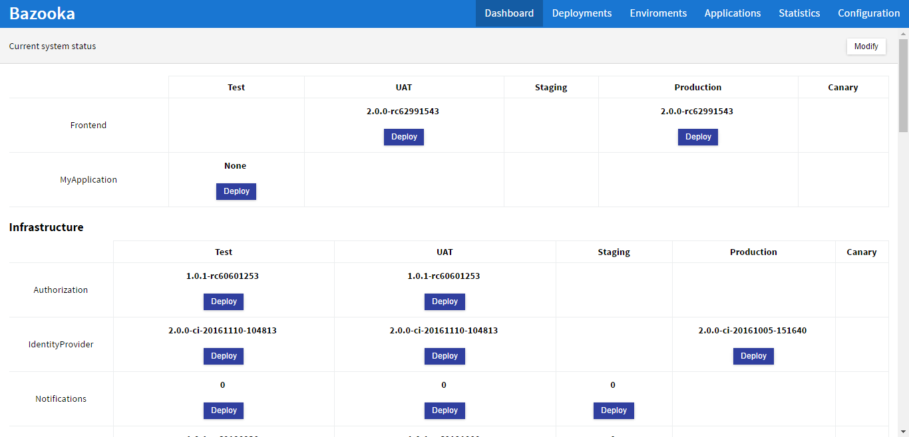
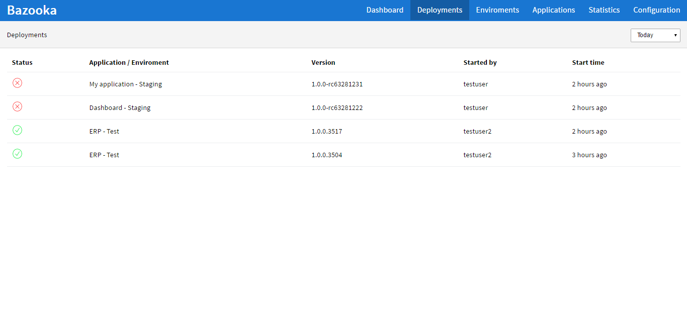
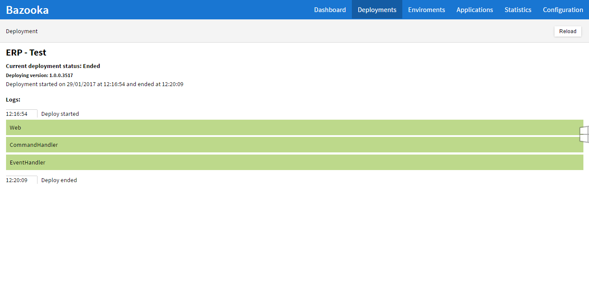
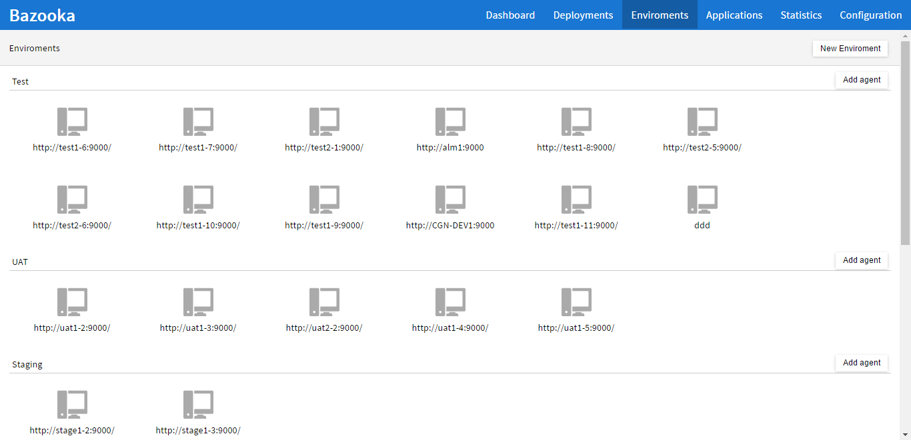
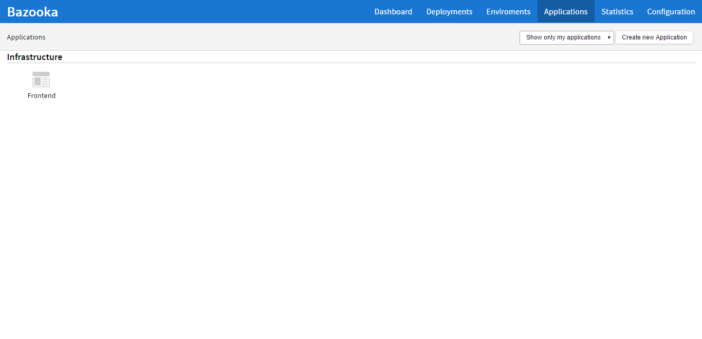
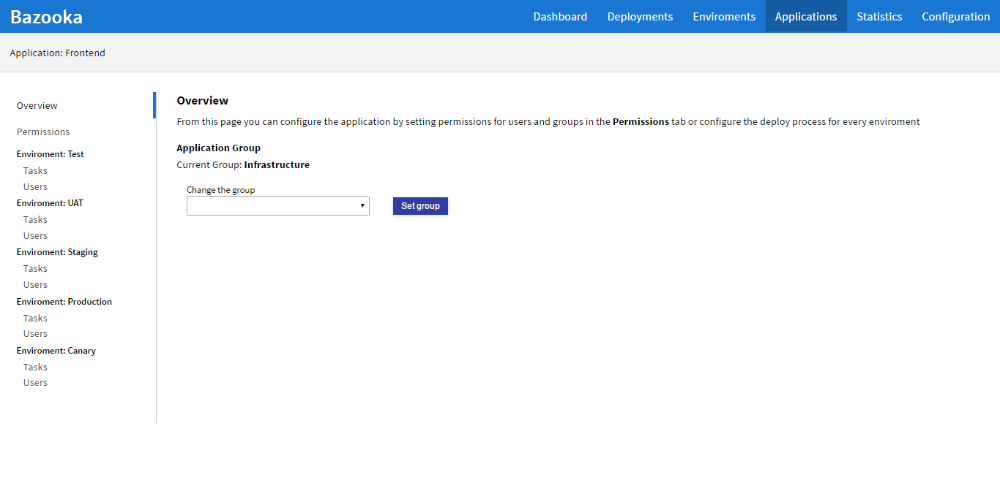
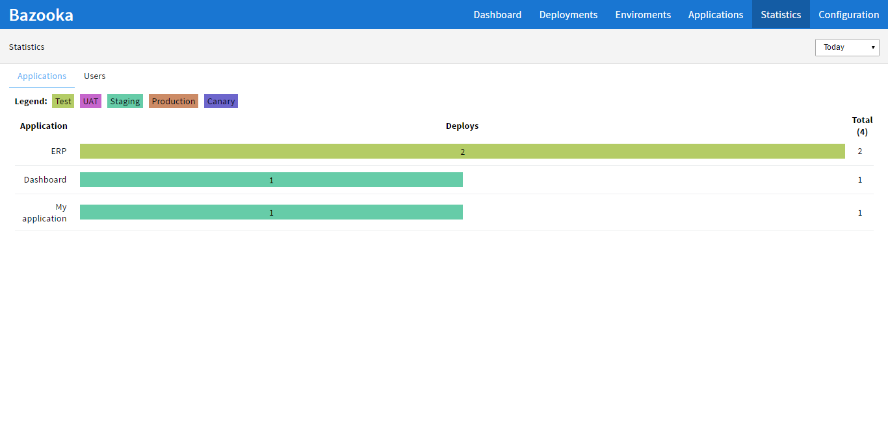
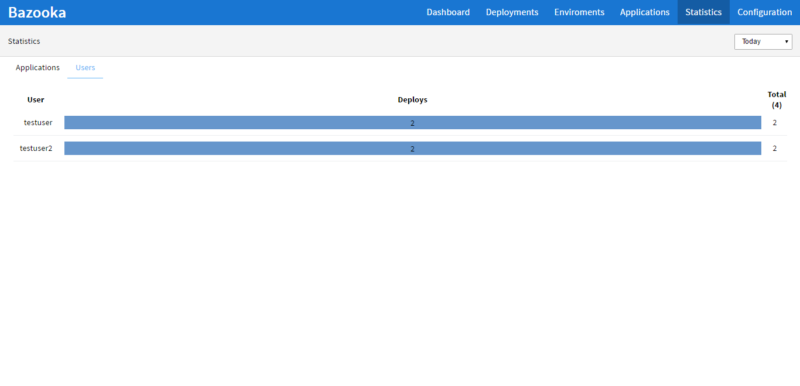
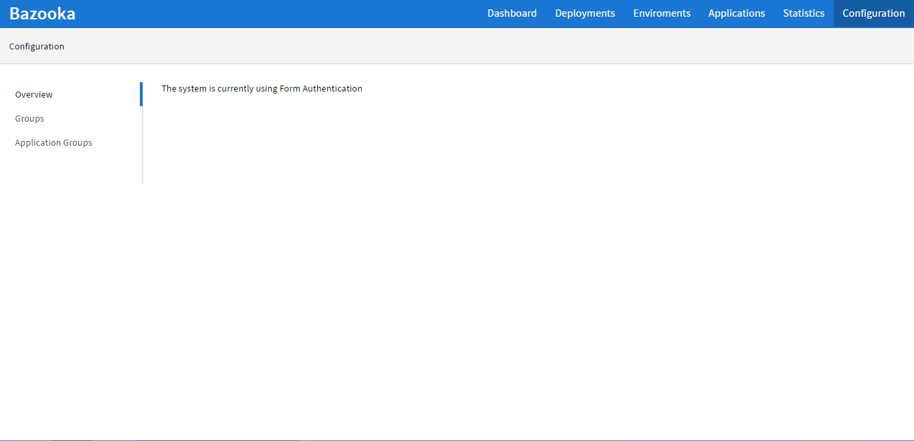

Walktrough
===================================

Bazooka has many different sections in its interface so it's useful to walk trough them one at a time.

Dashboard
-------------------------

The first section and the one you''l see once you login is the **Dashboard**. here you can see at  a glance the status of the entire system (or the part of it you are allowed to see). For each application and every enviroment where you have access it is shown the currently deployed version allowing you to quicily deploy a new version.

Optionally you can define groups of applications to more easily organize them visually. These groups can be then ordered by pressing the **Modify** button in the top left cornet and then ajdusting the position with the arrow buttons on each application group.

Deployments
-------------------------

The second tab and one of the most used is the **Deployments** tab. In this tab you can see your last deployments. For each deployment the first column indicates its state while on the rest of the line you can see the application / Enviroment where the deploy is happening, the user who launched it and the relative time it started.

By clicking on a deploy we can see its status in more detail. If the deploy is still running its status will be automatically refreshed every 10 seconds.

On the top left corner a drop-down will allow you to view older deployments.

Enviroments
---------------------------

The **Enviroments** section allows you to view and define the enviroments where your applications will be published and, for each enviroment, to register agents as targets for deployments.

In this page you can create new Enviroments by clicking the **Create new enviroment** button in the top left corner. Once one or more enviroments have been created you can start adding agents to each enviroment by clicking the **Add agent** button.

Applications
-------------------------

The **Applications** section allows you at a glance to view all the configured application in your system. Normally you will see only the applications for which you are an administrator or all if you are a global administrator but you can always see them all by using the drop down on the top left corner. If you have defined application groups the apps will be groupd by them allowing for a clearer view.

By  clicking on the **Create new application** button you can create a new application (requires administrator privileges).

By clicking on an application we can go to its configuration page where we will found a tabbed interface. On the right side of the page we can see some tabs:

**Overview**
  gives some general infos about the application and allows you to set the application group
**Permissions**
  allows you to define an application administrator, someone with full privileges only for this application
**Tasks**
  one tab for each enviroment this will allow you to define your deployment process and its composition in tasks
**Users**
  one tab for each enviroment allows you to give permissions to publish to specific users or groups

Statistics
------------------------------

The statistics page allows you to see some statistics about the usage of Bazooka in the specified period of time, configurable by the drop down in the top left corner. This section is divided in two tabs: **Applications** and **Users**.

The **Applications** tab will show for each application the number of deployments for each enviroment allowing you to spot irregularities like an application being only deployed to production.

The **Users** tab instead will show for each user then umber of deploys made in the specified period of time.

Configuration
-------------------------

The configuration section contains configuration for the entire system, as opposed to those specific to an application. This page is divided into several tabs:

**Overview**
  will give you some informations about the system
**Groups**
  will allow you to configure groups of users for easier handling of permissions
**Application Groups**
  will allow you to create application groups to group your applications

